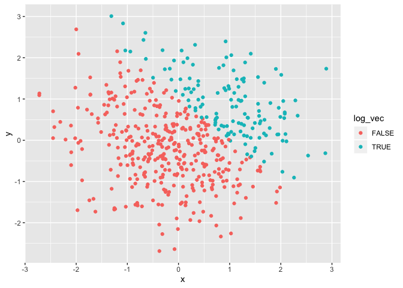
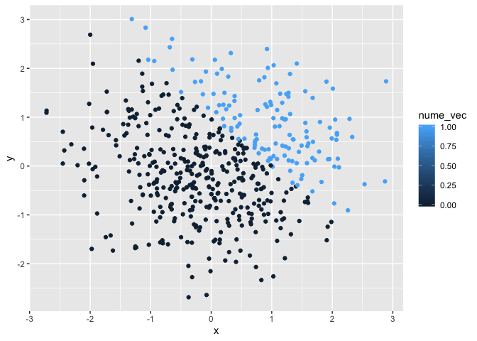
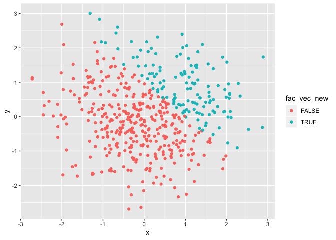

p8105\_hw1\_zc2443
================
Ziyang Chen zc2443
2019-09-14

``` r
library(tidyverse)

set.seed(1)
df = tibble(
  ran_samp = rnorm(8), #create random sample of size 8 from a standard Normal distribution
  ran_samp_pos = ran_samp > 0, #a logical vector indicating whether elements of the sample are greater than 0
  char_vec = c("p8105","is","so","funny","ziyang","chen","the","brilliant"), #create a character vector of length 8
  some_vec = c("low","medium","high","low","medium","high","low","high"), #create vector of length 8, with 3 different factor “levels”
  fac_vec = factor(some_vec) #make the above vector to be a factor vector
)

mean(df$ran_samp)
```

    ## [1] 0.1314544

``` r
mean(df$ran_samp_pos)
```

    ## [1] 0.625

``` r
mean(df$char_vec)
```

    ## Warning in mean.default(df$char_vec): argument is not numeric or logical:
    ## returning NA

    ## [1] NA

``` r
mean(df$fac_vec)
```

    ## Warning in mean.default(df$fac_vec): argument is not numeric or logical:
    ## returning NA

    ## [1] NA

When I took the mean values of each variable, the numeric and the
logical variables worked while the character and the factor variables
didn’t
work.

``` r
as.numeric(df$ran_samp_pos) #convert the logical vector to a numeric vector
as.numeric(df$char_vec) #convert the character vector to a numeric vector
as.numeric(df$fac_vec) #convert the factor vector to a numeric vector
```

For the logical vector, it was successfully converted to a numeric
vector since the origin values of this vector consists of 0 and 1 which
are already numeric values. For the character and the factor vectors,
they failed to be converted to numeric vectors since they are not
consist of numeric values. Hence, we can take the mean value of a
numeric value based vector but we cannot take the mean value of a
character vector or a factor
    vector.

``` r
as.numeric(df$ran_samp_pos)*df$ran_samp
```

    ## [1] 0.0000000 0.1836433 0.0000000 1.5952808 0.3295078 0.0000000 0.4874291
    ## [8] 0.7383247

``` r
factor(df$ran_samp_pos)*df$ran_samp
```

    ## Warning in Ops.factor(factor(df$ran_samp_pos), df$ran_samp): '*' not
    ## meaningful for factors

    ## [1] NA NA NA NA NA NA NA NA

``` r
as.numeric(factor(df$ran_samp_pos))*df$ran_samp
```

    ## [1] -0.6264538  0.3672866 -0.8356286  3.1905616  0.6590155 -0.8204684
    ## [7]  0.9748581  1.4766494

``` r
set.seed(2)
df_2 = tibble(
  x = rnorm(500),
  y = rnorm(500),
  log_vec = x + y > 1,
  nume_vec = as.numeric(log_vec),
  fac_vec_new = factor(log_vec)
)
```

The number of row in `df_2` is 500; the number of column in `df_2` is 5;
the mean of x is 0.0616923; the median of x is 0.0439172; the standard
deviation of x is 1.0323776; the proportion of cases for which x + y \>
1 is 0.266

``` r
ggplot(df_2, aes(x = x, y = y, color = log_vec)) + geom_point()
```

<!-- -->

``` r
ggplot(df_2, aes(x = x, y = y, color = nume_vec)) + geom_point()
```

<!-- -->

``` r
ggplot(df_2, aes(x = x, y = y, color = fac_vec_new)) + geom_point()
```

<!-- -->

When colored points using the logical and the factor vectors, the color
scale is differed by true or false. However, when colored points using
the numeric vectors, the color scale is differed by the numeric values
from low to high. As the values get lower the color becomes darker, as
the values get higher the color becomes
lighter.

``` r
ggsave("first_plot.png",plot = ggplot(df_2, aes(x = x, y = y, color = log_vec)) + geom_point())
```

    ## Saving 7 x 5 in image
